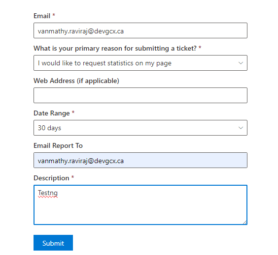

# Submit Ticket

## Summary
- A simple form that allows users of gcxchange to submit tickets to a submit ticket Azure Function.
- Able to change the language (English/French) in the property pane.
- Option of the form are base on the selected subject. 
- The ability to join a file is available on each option.

### Form with active submit button:

## Prerequisites
This web part connects to [This function app](https://github.com/gcxchange-gcechange/CreateTicketAzureFunction).

## API permission
None
## Version 

## Applies to

- [SharePoint Framework](https://aka.ms/spfx)
- [Microsoft 365 tenant](https://docs.microsoft.com/en-us/sharepoint/dev/spfx/set-up-your-developer-tenant)

> Get your own free development tenant by subscribing to [Microsoft 365 developer program](http://aka.ms/o365devprogram)

## Version history

| Version | Date         | Comments                |
| ------- | ------------ | ----------------------- |
| 1.0     | Mar 3, 2021 | Initial release         |
| 1.1     | Dec 20, 2023 | Upgraded to SPFX 1.17.4 |

## Minimal Path to Awesome
- Clone this repository
- Ensure that you are at the solution folder
- To install the dependencies, in the command-line run:
  - **npm install**
- Add the Client Id and the url of the function app mentioned in the section Prerequisites to the file `src\webparts\submitTicket\components\SubmitTicket.tsx`
- To debug in the front end:
  - go to the `serve.json` file and update `initialPage` to :
    - `https://your-domain-name.sharepoint.com/_layouts/15/workbench.aspx`
  - In the command-line run:
    - **gulp serve**
- To deploy:
  - In the command-line run:
    - **gulp clean**
    - **gulp bundle --ship**
    - **gulp package-solution --ship**
  - Add the webpart to your tenant app store
- Add the Webpart to a page
## Disclaimer
**THIS CODE IS PROVIDED *AS IS* WITHOUT WARRANTY OF ANY KIND, EITHER EXPRESS OR IMPLIED, INCLUDING ANY IMPLIED WARRANTIES OF FITNESS FOR A PARTICULAR PURPOSE, MERCHANTABILITY, OR NON-INFRINGEMENT.**